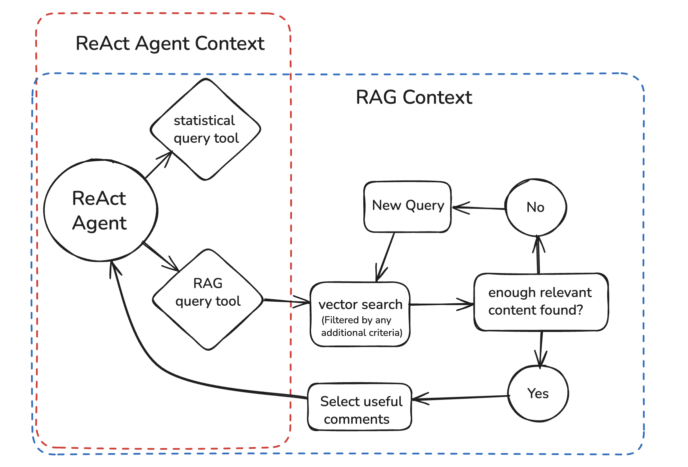

# Reggie: An Agentic RAG Tool for Analyzing Comments on Regulations.gov

Reggie is an end-to-end tool for loading, processing, and analyzing comments on regulation documents on [Regulations.gov](https://www.regulations.gov/), with a particular focus on Healthcare regulations.

Data is loaded from the public API and processed by tagging with a lightweight LLM and chunking/embedding for vector search.

This data is saved in postgresql and exposed through query tools an agent can use to make statistical queries or text-based RAG searches (with optional filtering on the tagged metadata).  

## RAG Graph



## Design Notes

### Tagging

During processing, each comment is classified by a lightweight LLM (gpt-5-nano) along three dimensions:

- **Category**: Who is commenting (e.g., "Physicians & Surgeons", "Patient Advocates", "Hospitals & Health Systems")
- **Sentiment**: Position on the regulation ("for", "against", "mixed", "unclear")
- **Topics**: What they discuss (e.g., "reimbursement_payment", "access_to_care", "administrative_burden")

Detailed enums can be viewed in [comment.py](https://github.com/jtermaat/reggie/blob/main/reggie/models/comment.py).

These tags are stored as structured metadata in PostgreSQL alongside the embeddings.

### Tools: Statistical Queries and Filtered RAG

This tagging enables the agent to use two tools: A statistical query tool, and a text-based RAG search with optional filtering on tagged metadata.

The statistical queries allow it to answer questions like:

> "What do doctors generally think about this rule?"

Filtered RAG queries allow it to answer questions like:

> "What do physicians think about reimbursement?"

The agent can filter the vector search to only comments where:
- `category = "Physicians & Surgeons"`
- `topics = ["reimbursement_payment"]`

### Separated RAG Sub-Agent

Rather than having the discussion agent directly call vector search, we use a **separate LangGraph sub-agent** ([rag_graph.py](https://github.com/jtermaat/reggie/blob/main/reggie/agent/rag_graph.py)) for retrieval:


**Context Savings for the main agent**

The RAG sub-agent evaluates chunk snippets and decides which comments are relevant *before* returning results to the main agent. The discussion agent only sees the final, filtered set of complete comments—not all the intermediate search results and assessments, avoiding context pollution.


### Evaluation Framework

The evaluation dataset can be viewed [here along with evaluation runs](https://smith.langchain.com/public/97d8f43d-6ad7-4cc9-9b02-c9c37ef4768d/d).

Queries are ranked Easy, Medium, and Hard, with evaluators for completeness, accuracy, relevance, filter application, and tool choice.


## Quick Start

### Prerequisites

- Python 3.9+
- PostgreSQL with pgvector (or use Docker)
- OpenAI API key

### 1. Start PostgreSQL (Docker)

```bash
docker run --name reggie-postgres \
  -e POSTGRES_PASSWORD=postgres \
  -e POSTGRES_DB=reggie \
  -p 5432:5432 \
  -d pgvector/pgvector:pg16
```

### 2. Install Reggie

```bash
# Clone or navigate to the reggie directory
cd /path/to/reggie

# Create virtual environment
python -m venv .venv
source .venv/bin/activate  # On Windows: .venv\Scripts\activate

# Install reggie and all dependencies
pip install -e .
```

### 3. Configure Environment

```bash
# Copy example env file
cp .env.example .env

# Edit .env and add your OpenAI API key
# Minimum required:
# OPENAI_API_KEY=sk-...your-key-here...
```

### 4. Initialize Database

```bash
reggie init
```

You should see: "✓ Database initialized successfully!"

### 5. Load a Document

```bash
reggie load CMS-2025-0304-0001
```

This will fetch all the comments for that document.

**Note**: This may multiple hours depending on the number of comments, due to rate limiting. For a quick test, choose a document with a low number of comments. For example, [CMS-2025-0304-0001](https://www.regulations.gov/document/CMS-2025-0304-0001) has only 10 comments.

### 6. Process the Comments

  ```bash
  reggie process CCMS-2025-0304-0001
  ```

  Processes comment data for the given document, including chunking and embedding, and tagging the comments by who is commenting, the topics they commented on, and their sentiment. The enums in [comment.py](https://github.com/jtermaat/reggie/blob/main/reggie/models/comment.py) show the kinds of tags that can be used.  
  Note: Processing uses OpenAI API calls and may take time depending on the number of comments.

### 7. Start a Discussion

  ```bash
  reggie discuss CMS-2025-0304-0001
  ```

  Opens a dialogue with an agent.  The agent can query the comment data with vector search and filter by the tags we added during processing.  The agent can also make statistical queries to answer questions about the general support level of various types of commenters, or what sorts of topics were raised by whom.

  - "What do physicians think about this rule?"
  - "What concerns were raised about reimbursement?"

  **Note**: When the agent makes statistical queries, visualizations are automatically displayed showing bar charts of the results with color-coded sentiment breakdowns.

### 8. Visualize Opposition/Support

  ```bash
  reggie visualize CMS-2025-0304-0001
  ```

  Displays a comprehensive opposition vs. support visualization showing sentiment breakdown across all commenter categories. The centered bar chart shows:
  - Categories sorted by total comment count
  - Opposition (red bars, left) and support (green bars, right) percentages
  - Total comments per category
  - Percentages based on total category comments (allowing users to deduce mixed/unclear sentiment)


## Tradeoffs and Next Steps

Time was the most challenging constraint in this project, and there are plenty of things left to do.  Here are some critical areas:

- Right now, there is room for some enhancement to the integration between the ReAct agent and the rag graph.  This is a critical issue in the functionality of the tool that hasn't been fully resolved purely due to time constraints.  I'm happy to discuss this in more depth.

- Right now, I'm using gpt-5-nano to tag the comments, but given this that this is a simple classification task, we could likely switch to a lightweight open source model.  One candidate to try is [Extract-0](https://github.com/herniqeu/extract0)

- We should do more experiments to tune the parameters in config.py. Chunk_size and chunk_offset could likely benefit from smaller values, but there hasn't been time to effectively experiment with this.

- Right now, we're stuck with a tradeoff where we can either use gpt-5-mini for the agent, or we can have streaming responses from OpenAI.  Experiments show that gpt-5-mini is superior.  We need to verify with OpenAI to enable streaming with gpt-5-mini.

- Since this tool could benefit from both visualizations and links to comment pages on regulations.gov, it would be beneficial to build a web front-end rather than having it live on the command-line. 
